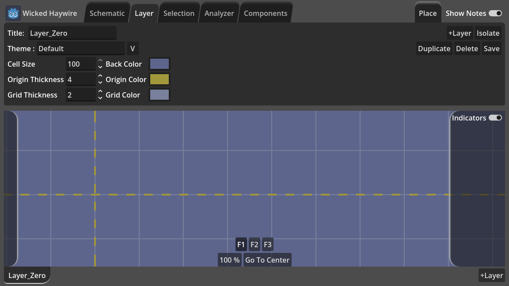
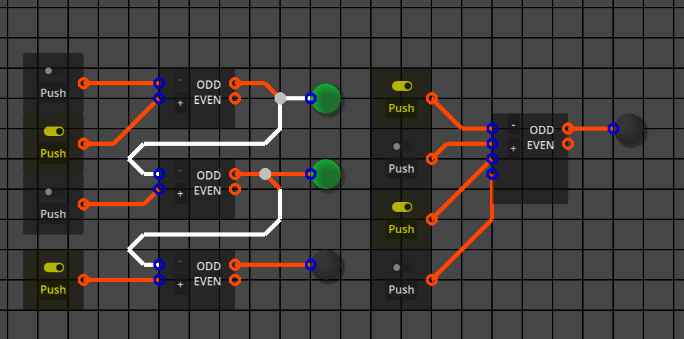

# Wicked_Haywire

For Paracortical Initiative, 2025, Diogo "Saliko" Duarte

Other projects:
- [Bluesky for news on any progress I've done](https://bsky.app/profile/diogo-duarte.bsky.social)
- [Itchi.io for my most stable playable projects](https://diogo-duarte.itch.io/)
- [The Github for source codes and portfolio](https://github.com/Theklo-Teal)
- [Ko-fi is where I'll accept donations](https://ko-fi.com/paracortical)

## Description
A digital electronics circuit simulator made in the [Godot Engine](https://github.com/godotengine/godot). Based on [InfiCanvas](https://github.com/Theklo-Teal/Godot_Infinite_Canvas) and used as a platform to further develop that project.

This project was motivated by the perceived shortcomings of [Logisim](https://github.com/logisim-evolution/logisim-evolution) and it's outdated UI. Other circuit simulators always have something I don't like, so I made my own.

This is planned as toy-like digital simulator for me to tinker with CPU architecture designs. But the simulation system is rather robust and I might be able to make analogue electronics simulation with it eventually. It looks like I could basically simulate any network system, really.

This is not a formal or conventional simulator and departs from what you'd learn in electronics learning courses a lot. Like logic gates having funny names or certain system behaviors having their own component, which doesn't really exist as a single unit in real life, say a configurable monostable vibrator.

You can think of this as my personal paraphrasing of the electronics learning I've done and that can have educational value.

Check out the «media» folder for demonstrations I've made along development.

## Features (work-in-progress)
Nifty graphical interface reminiscent of the 80's tape players. (I want to believe)

Layers for different parts of the circuit, so it's less of a mess and make it possible to have high area density of components.

Layers can be exported as their own custom components.

Layers can be themed independently.

Components can be made to be configurable, with variable numbers of inputs or alternate behaviors, for example. What in other simulators there are many variations of the same component, in here a single component behave like different behaviors depending on parameters.

A "tunnel", "label" or "via" mechanism allows connecting shortcuts in the wiring between distant parts of the schematic or even between layers.

Devices with input and output controls, like switches and light indicators can be pinned to two side panels granting ever present access regardless of where they are in the schematic. Inspired by [Sebastian Lague's simulator](https://github.com/SebLague/Digital-Logic-Sim).

## Issues
This project has been on hiatus due the wiring editing part being really complicated. Most circuits simulators have simple ways to connect devices, but I wanted to have it work like in Logisim and build upon that.

## Future Improvements
I intend to add devices taking inspiration from Minecraft redstone circuits, like configurable delay lines (Minecraft repeater). If someone suggests me other systems like this, I might consider implementing them.

I've been considering implementing a device emulating an abstract microcontroller which would be programmed with an IDE, maybe similar in architecture to those in [Shenzhen IO](https://www.zachtronics.com/shenzhen-io/) or even something wacky like single instruction CPUs like in [SIC-1](https://jaredkrinke.itch.io/sic-1), but it will take a long time to develop.

Depending on how the wire editing turns out at the end, it might be possible to use this application as a PCB designing tool, by exporting vector graphics, which then CAM software uses or that can be printed into stencils.
